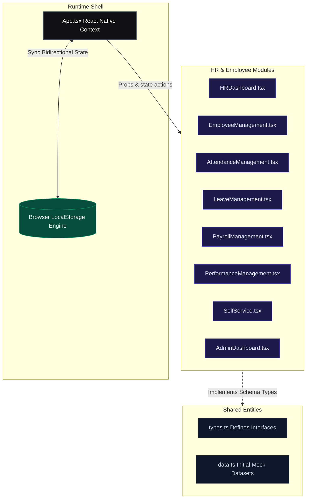
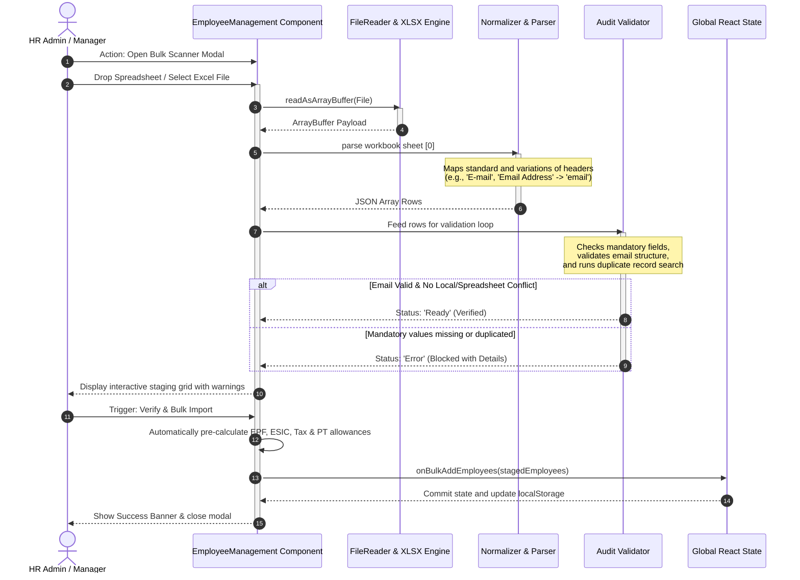
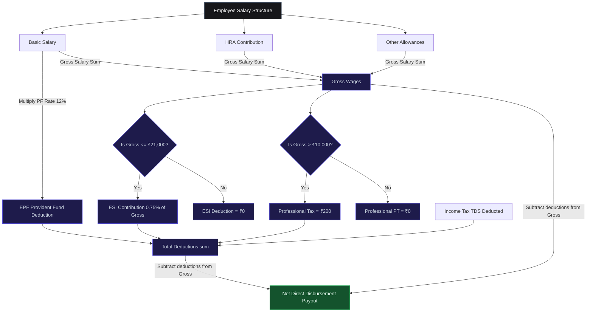
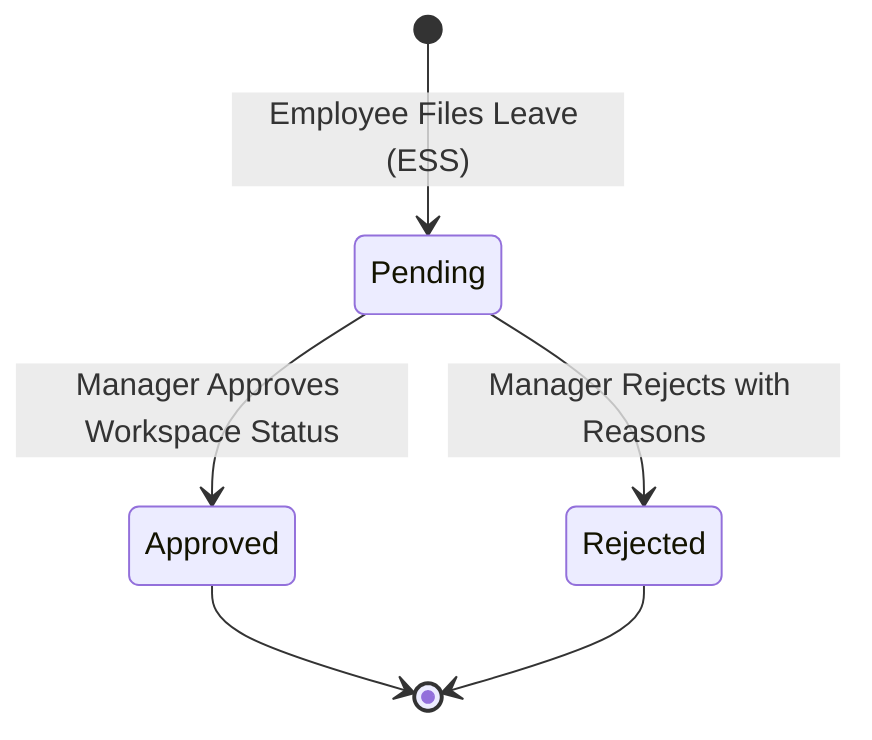
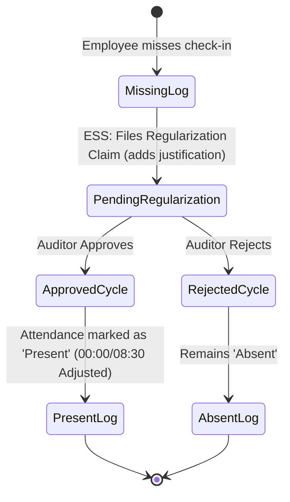
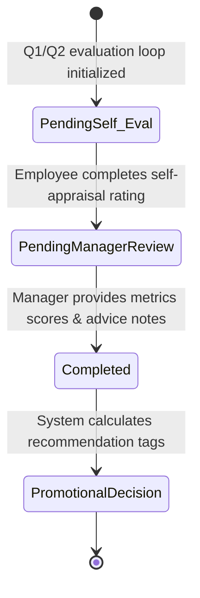

# HRMS Enterprise Architecture & Technical Specification

This document provides a comprehensive technical overview of the **Human Resource Management System (HRMS)** architecture, including structural flowcharts, operational pipelines, and statutory rule specifications.

---

## 1. High-Level Component Topology

The system is constructed as a modern, single-page full-stack React application with high-fidelity components, rich client-side persistence, and strict separation of concerns.

---

## 2. Employee Bulk Excel Upload Pipeline

The bulk upload feature parses, validates, and imports employee records dynamically from Excel documents (`.xlsx`, `.xls`, `.csv`). It automates validation, checks for system conflicts, and runs statutory wage calculations in real time before committing records.

---

## 3. Indian Statutory Compliance & Payroll Engine

For active payroll calculations, the system respects standard regulatory mandates and models.

### Deductions Formula Flow

---

## 4. Multi-Actor State Transitions & Lifecycle Loop

The application provides dual workflows: Employee Self-Service (ESS) and HR / Operations dashboards. Below are the key states transitioned by these roles.

### A. Leave Request Lifecycle

### B. Attendance Missed-Punch Regularization

### C. Performance Review Loop

